# Skillora

## 1. Introduction

### 1.1 Purpose

This document details the requirements for an Skillora system designed to streamline the initial stages of the hiring process. The system automates job posting with AI-generated content, application processing, candidate CV/resume matching against job descriptions (JD), filtering, HR notifications, candidate communications, optional skill assessments, and interview scheduling. Leveraging Generative AI (Gen AI), LangChain, and AI agents, the system reduces manual effort, minimizes bias, and enhances efficiency.

The primary goals are:

- Automate repetitive hiring tasks to handle high application volumes.
- Ensure objective candidate evaluation using AI-based matching and assessments.
- Comply with data privacy and ethical standards.
- Provide a scalable, modular platform integrable with HR tools.

### 1.2 Scope

The system covers the hiring workflow:

- Job posting with AI-generated content (text, images, videos) on social media (LinkedIn, X/Twitter, Instagram, Facebook) and the organization’s website.
- Automated parsing and matching of CVs with JDs.
- Filtering and shortlisting candidates.
- Real-time notifications to HR for approval.
- Automated, personalized emails to candidates.
- Optional skill assessments for shortlisted candidates (if enabled by HR).
- Automated interview scheduling by HR, post-assessment (if enabled).

**Secondary Feature (Future Implementation)**: Employee Referral Portal for internal candidate recommendations.

**Future Development**: Features like AI-generated interview questions, diversity analytics, and talent pool management are planned for later phases.

Out of scope for MVP:

- Full interview execution (e.g., video conferencing).
- Background checks or final offer generation.
- Advanced analytics beyond basic reporting.
- Immediate implementation of the referral portal and other future features.

### 1.3 Definitions and Acronyms

- **JD**: Job Description – Details the requirements, responsibilities, and qualifications for a position.
- **CV/Resume**: Candidate’s professional profile document.
- **Gen AI**: Generative Artificial Intelligence – AI models for generating text (e.g., GPT) and multimedia (e.g., DALL-E).
- **AI Agent**: Autonomous software entities performing tasks and making decisions (e.g., using LangChain).
- **HR**: Human Resources – The department managing hiring.
- **MVP**: Minimum Viable Product – Initial version with core features.
- **API**: Application Programming Interface – For external service integrations.
- **Referral Portal**: Internal platform for employee referrals.
- **EKS**: Amazon Elastic Kubernetes Service – Kubernetes-based container orchestration.
- **SonarQube**: Code quality analysis tool for detecting bugs, vulnerabilities, and code smells.

### 1.4 References

- Previous project discussions (internal notes).
- Standards: GDPR for data privacy, WCAG 2.1 for accessibility.
- Tools: OpenAI API for Gen AI (text, images, videos), LangChain for AI agents, Google Calendar/Outlook APIs for scheduling, HackerRank/Codility APIs for assessments, SonarQube for code quality.

### 1.5 Overview

This SRS is structured as follows:

- Section 2: Overall Description.
- Section 3: Functional Requirements (step-by-step with detailed sub-requirements).
- Section 4: Non-Functional Requirements.
- Section 5: Use Cases.
- Section 6: Assumptions and Dependencies.
- Section 7: Future Development Features.
- Section 8: Appendices.

## 2. Overall Description

### 2.1 Product Perspective

The system enhances traditional Applicant Tracking Systems (e.g., Lever, Greenhouse) by integrating Gen AI for intelligent content generation, candidate matching, and assessment creation, and AI agents for workflow automation using LangChain. It addresses inefficiencies like manual CV screening, assessment design, and interview scheduling. The application submission process collects additional profile links (e.g., GitHub, portfolio) to enhance candidate evaluation, particularly for technical roles. The optional Candidate Skill Assessment validates qualifications before scheduling, and Interview Scheduling Automation enables HR to finalize interview times based on system-proposed slots. The system leverages cloud tools (AWS, MongoDB Atlas) and DevOps practices (Jenkins, Docker, Git, AWS CodePipeline, SonarQube) for scalability, reliability, and maintainability.

### 2.2 Product Features

- Automated job posting with AI-generated text, images, and videos.
- CV parsing and JD-CV matching using Gen AI.
- Candidate filtering and ranking.
- Real-time HR notifications and approvals.
- Personalized email communications.
- Optional skill assessments for shortlisted candidates.
- Automated interview scheduling by HR, based on system-proposed slots.
- Dashboard for monitoring, reporting, and scheduling.
- Code quality analysis via SonarQube to ensure maintainability.
- **Secondary Feature**: Employee Referral Portal (future).
- **Future Features**: AI-generated interview questions, diversity analytics, etc.

### 2.3 User Classes and Characteristics

- **HR/Admin Users**: Experienced in hiring; require tools for posting, updating, disabling, removing content to target audience, approving, assessing, scheduling interviews, and oversight; expect intuitive interfaces.
- **Jobseekers/Applicants**: General users; interact via application forms, assessment portals, and receive scheduling communications; expect clear communication.
- **Internal Employees**: Organization staff; use referral portal (future); need simple submission processes.
- **System Admins**: IT staff; manage maintenance, integrations, deployments, and code quality; require robust documentation and SonarQube reports.

### 2.4 Operating Environment

- Web-based application hosted on AWS.
- Compatible with modern browsers (Chrome, Firefox, Edge).
- Frontend: Next.js with TypeScript, Tailwind CSS, and Shadcn/UI.
- Backend: Node.js (Next.js API routes), integrated with MongoDB.
- Mobile-responsive interfaces for application forms and assessments.
- **Deployment**: Managed via AWS EKS with Docker for container orchestration; Jenkins, SonarQube, and AWS CodePipeline for CI/CD, ensuring automated deployments and code quality analysis.

### 2.5 Design and Implementation Constraints

- Use open-source or licensed Gen AI models (e.g., Hugging Face for embeddings, OpenAI for text/images).
- AI agents built with LangChain for modularity.
- Handle API rate limits for social media, email, calendar, and assessment services.
- Modular design for referral portal and future features.
- TypeScript for type safety across frontend and backend.
- CI/CD pipeline with Jenkins, SonarQube, and AWS CodePipeline for automated deployments and code quality checks.

### 2.6 Assumptions and Dependencies

- **Dependencies**: Stable internet for APIs (social media, email, calendar, assessment platforms); budget for Gen AI usage; Jenkins server, SonarQube server, and AWS CodePipeline for CI/CD; EKS cluster for container orchestration.
- **Assumptions**: HR provides sample JDs, CVs, calendar access, and assessment requirements; users have basic tech literacy; Auth0 for SSO; valid GitHub/portfolio/relevant links provided by candidates; Git repository hosted (e.g., GitHub); SonarQube configured for code analysis.

## 3. Functional Requirements

The requirements are developed step by step, with detailed sub-requirements, implementation considerations, and integration points, mirroring Version 1.0’s granularity. Sub-Req 2.1.1 includes GitHub profile and portfolio links for technical roles and relevant links for non-technical roles. Candidate Skill Assessment Integration (Step 6) is optional, followed by the Interview Scheduling Module (Step 7).

### Step 1: Job Posting Module

**FR1.1**: The system shall allow authorized HR/Admins to create and post JDs, including AI-assisted content generation.it allows user to interact with AI chatbot to create the conetent unit they satisfied.

- **Sub-Req 1.1.1**: Provide input fields for job title, description, requirements, location, salary range (optional), and multimedia uploads (e.g., company logo, videos).
  - **Implementation**: Next.js form components with TypeScript interfaces; styled with Tailwind CSS and Shadcn/UI; store inputs in MongoDB.
  - **Integration**: AWS Amplify for hosting; MongoDB Atlas for storage.
- **Sub-Req 1.1.2**: Integrate with social media APIs (LinkedIn, X/Twitter, Instagram, Facebook) and website CMS for posting.
  - **Implementation**: Use Next.js API routes with TypeScript for OAuth-based API calls; ensure platform-specific formats (e.g., Instagram’s image/video constraints).
  - **Integration**: LinkedIn Jobs API, Twitter API v2, Meta Graph API; AWS API Gateway for secure calls.
- **Sub-Req 1.1.3**: Enable scheduling of posts and tracking of analytics (e.g., impressions, clicks).
  - **Implementation**: Use node-schedule in Next.js backend; store analytics in MongoDB.
  - **Integration**: Social media analytics APIs; AWS CloudWatch for logging.
- **Sub-Req 1.1.4**: Use Gen AI to generate optimized post content (e.g., concise summaries).
  - **Implementation**: Prompt Gen AI (e.g., OpenAI GPT) via LangChain with: “Create a 280-character job post for \[JD\].”
  - **Integration**: OpenAI API; LangChain for prompt management.
- **Sub-Req 1.1.5**: Allow HR to input custom prompts for AI to generate job post elements (text, image banners, videos).
  - **Implementation**: Shadcn/UI text area for prompts (e.g., “Generate a tech-themed job ad”); TypeScript for input validation.
  - **Integration**: OpenAI API for text, DALL-E for images, video APIs (if available).
- **Sub-Req 1.1.6**: AI agent shall create content using Gen AI tools.
  - **Implementation**: LangChain agent orchestrates text and image generation.
  - **Integration**: Store assets in AWS S3.
- **Sub-Req 1.1.7**: Present generated content for HR verification/approval via dashboard.
  - **Implementation**: Next.js dashboard with Shadcn/UI components for preview (text, images, videos); TypeScript for data types.
  - **Integration**: WebSocket (via AWS API Gateway) for real-time previews.
- **Sub-Req 1.1.8**: Upon approval, AI agent auto-posts to selected platforms and website.
  - **Implementation**: LangChain agent triggers API calls; log status in MongoDB.
  - **Integration**: AWS SQS for reliable posting.

**FR1.2**: Validate postings for compliance (e.g., Equal Employment Opportunity statements).

- **Implementation**: Use Gen AI to check compliance keywords; flag issues in dashboard.
- **Integration**: Store compliance templates in MongoDB.

### Step 2: Application Submission Module

**FR2.1**: The system shall provide a user-friendly form for jobseekers to apply.

- **Sub-Req 2.1.1**: Collect CV (PDF/DOCX), cover letter, contact info (name, email, phone), and optional links (LinkedIn, GitHub profile and portfolio for technical roles, or relevant links for non-technical roles, e.g., personal website, Behance for design roles).
  - **Implementation**: Next.js form with Shadcn/UI components; TypeScript for type safety; Tailwind CSS for styling; dynamically display GitHub/portfolio fields for technical JDs (based on JD metadata) or relevant link fields for non-technical JDs; validate URLs (e.g., ensure valid GitHub/Behance links).
  - **Integration**: AWS S3 for file uploads; MongoDB for metadata and links; use JD metadata to determine role type (technical/non-technical).
- **Sub-Req 2.1.2**: Implement file upload validation (size < 5MB, formats: PDF, DOCX).
  - **Implementation**: Server-side validation in Next.js API routes; user feedback via Shadcn/UI alerts.
  - **Integration**: AWS S3 with presigned URLs.
- **Sub-Req 2.1.3**: Include CAPTCHA or anti-spam measures.
  - **Implementation**: Integrate reCAPTCHA v3 in Next.js form.
  - **Integration**: Google reCAPTCHA API.
- **Sub-Req 2.1.4**: Store applications securely with timestamps.
  - **Implementation**: Encrypt sensitive data in MongoDB using AWS KMS; include fields for GitHub/portfolio/relevant links.
  - **Integration**: MongoDB Atlas with encryption.

**FR2.2**: Acknowledge receipt via email to the applicant.

- **Implementation**: Send templated email with Gen AI personalization via Next.js API route, referencing submitted links if provided.
- **Integration**: AWS SES for email delivery.

### Step 3: CV Parsing and Matching Module

**FR3.1**: The system shall parse CVs using Gen AI to extract structured data.

- **Sub-Req 3.1.1**: Extract skills, experience years, education, job history, and submitted links (e.g., GitHub, portfolio, relevant links).
  - **Implementation**: Prompt Gen AI (e.g., “Extract skills, experience, and links as JSON”) via LangChain; TypeScript for data validation.
  - **Integration**: OpenAI API or Hugging Face for NLP; parse links for additional context (e.g., GitHub repos).
- **Sub-Req 3.1.2**: Handle diverse formats (e.g., multilingual, scanned PDFs) via OCR.
  - **Implementation**: Use Tesseract for OCR; preprocess for Gen AI in Next.js backend.
  - **Integration**: AWS Textract for OCR.
- **Sub-Req 3.1.3**: Use AI agents to chain parsing tasks (e.g., PDF to text, then extract).
  - **Implementation**: LangChain agent orchestrates OCR and parsing.
  - **Integration**: Store parsed data, including links, in MongoDB.

**FR3.2**: Match parsed CV against JD.

- **Sub-Req 3.2.1**: Compute semantic similarity using Gen AI embeddings (cosine similarity > 90%), incorporating GitHub/portfolio/relevant links for technical/non-technical roles.
  - **Implementation**: Use Sentence Transformers or OpenAI Embeddings in Next.js backend; weight links (e.g., GitHub activity) for technical roles.
  - **Integration**: MongoDB with vector search (e.g., Atlas Search).
- **Sub-Req 3.2.2**: Generate match scores and explanations (e.g., “High match in Python; strong GitHub contributions”).
  - **Implementation**: Gen AI via LangChain for summaries; TypeScript for structured output.
  - **Integration**: Store scores in MongoDB.
- **Sub-Req 3.2.3**: AI agent to rank candidates and flag edge cases (e.g., incomplete data, invalid links).
  - **Implementation**: LangChain agent prioritizes candidates; flags for HR.
  - **Integration**: Dashboard alerts via Next.js.

**FR3.3**: Filter and shortlist candidates based on configurable thresholds.

- **Implementation**: HR sets thresholds via Shadcn/UI dashboard; store in MongoDB.
- **Integration**: Link to notifications.

### Step 4: HR Notification Module

**FR4.1**: Notify HR of shortlisted candidates.

- **Sub-Req 4.1.1**: Send real-time alerts via email, Slack/Teams, or dashboard.
  - **Implementation**: WebSocket for dashboard; Next.js API routes for email/Slack.
  - **Integration**: Slack API, Microsoft Teams webhook, AWS SES.
- **Sub-Req 4.1.2**: Include candidate summaries generated by Gen AI, including relevant links (e.g., GitHub, portfolio).
  - **Implementation**: Prompt Gen AI via LangChain for CV and link highlights.
  - **Integration**: Store summaries in MongoDB.
- **Sub-Req 4.1.3**: Provide approval/reject interface with one-click actions.
  - **Implementation**: Shadcn/UI buttons in Next.js dashboard; TypeScript for actions.
  - **Integration**: Update candidate status in MongoDB.

**FR4.2**: Log notifications for auditing.

- **Implementation**: Store logs with timestamps in MongoDB.
- **Integration**: AWS CloudWatch for additional logging.

### Step 5: Approval and Communication Module

**FR5.1**: Upon HR approval, send automated emails to candidates.

- **Sub-Req 5.1.1**: Personalize emails using Gen AI (e.g., “Based on your skills and GitHub contributions...”).
  - **Implementation**: Prompt Gen AI via LangChain; Next.js API route for sending.
  - **Integration**: AWS SES.
- **Sub-Req 5.1.2**: Include next steps (e.g., assessment or interview details) and tracking links.
  - **Implementation**: Embed links to assessment portal or interview details.
  - **Integration**: AWS API Gateway for tracking URLs.
- **Sub-Req 5.1.3**: AI agent to handle follow-ups (e.g., reminders after 3 days).
  - **Implementation**: Scheduler in Next.js backend; LangChain agent tracks responses.
  - **Integration**: AWS SQS for reliability.

**FR5.2**: Send polite automated decline emails for rejections.

- **Sub-Req 5.2.1**: Optionally use Gen AI to customize rejection reasons.
  - **Implementation**: Template-based emails with AI personalization.
  - **Integration**: AWS SES.

**FR5.3**: Integrate with email services for delivery tracking.

- **Implementation**: Track opens/clicks via analytics in Next.js.
- **Integration**: AWS SES analytics.

### Step 6: Candidate Skill Assessment Module (Optional)

**FR6.1**: The system shall provide an optional feature to enable role-specific skill assessments for shortlisted candidates before scheduling interviews, if required by HR.

- **Sub-Req 6.1.1**: Allow HR to enable/disable assessments per JD via dashboard.
  - **Implementation**: Shadcn/UI toggle in Next.js dashboard; store setting in MongoDB.
  - **Integration**: MongoDB Atlas.
- **Sub-Req 6.1.2**: Use Gen AI to generate role-specific assessment content (e.g., coding tests, quizzes), leveraging GitHub/portfolio data for technical roles.
  - **Implementation**: Prompt Gen AI (e.g., “Generate a Python coding test based on JD and GitHub”) via LangChain; TypeScript for structured output.
  - **Integration**: OpenAI API or Hugging Face.
- **Sub-Req 6.1.3**: Integrate with third-party assessment platforms (e.g., HackerRank, Codility) or host custom assessments.
  - **Implementation**: Next.js API routes for external platform calls or custom assessment UI with Shadcn/UI.
  - **Integration**: HackerRank/Codility APIs; MongoDB for custom tests.
- **Sub-Req 6.1.4**: AI agent to evaluate assessment responses and update match scores.
  - **Implementation**: LangChain agent processes results; updates scores from FR3.2.
  - **Integration**: Store results in MongoDB.
- **Sub-Req 6.1.5**: Provide candidates with a secure portal to complete assessments.
  - **Implementation**: Next.js portal with Auth0 SSO; Tailwind CSS styling.
  - **Integration**: Secure session management.
- **Sub-Req 6.1.6**: Notify candidates of assessment requirements via email with Gen AI personalization.
  - **Implementation**: Prompt Gen AI for emails via LangChain.
  - **Integration**: AWS SES.
- **Sub-Req 6.1.7**: Log assessment results and actions for auditing.
  - **Implementation**: Store results, timestamps, scores in MongoDB.
  - **Integration**: AWS CloudWatch for logging.

### Step 7: Interview Scheduling Module

**FR7.1**: The system shall automate interview scheduling for shortlisted candidates (post-assessment, if enabled), with HR finalizing the schedule.

- **Sub-Req 7.1.1**: Integrate with HR and candidate calendars (e.g., Google Calendar, Outlook) via APIs to fetch available slots.
  - **Implementation**: Next.js API routes with TypeScript for OAuth-based calendar access.
  - **Integration**: Google Calendar API, Microsoft Graph API; AWS API Gateway.
- **Sub-Req 7.1.2**: AI agent to suggest optimal interview times based on HR availability, candidate time zones, job urgency, and assessment completion (if enabled).
  - **Implementation**: LangChain agent analyzes calendar data, assessment status, and JD metadata.
  - **Integration**: MongoDB for metadata.
- **Sub-Req 7.1.3**: Provide HR with a secure web interface to review proposed slots and finalize the interview schedule.
  - **Implementation**: Next.js dashboard with Shadcn/UI components for slot selection and confirmation; TypeScript for type safety.
  - **Integration**: Auth0 for secure access; MongoDB for storing finalized schedules.
- **Sub-Req 7.1.4**: Send calendar invites and confirmation emails to candidates using Gen AI for personalized messaging, based on HR-finalized schedules.
  - **Implementation**: Prompt Gen AI via LangChain for invite text; Next.js API route for sending invites.
  - **Integration**: Calendar APIs; AWS SES for emails.
- **Sub-Req 7.1.5**: Automate reminders (e.g., 24 hours before) and handle rescheduling requests via HR dashboard.
  - **Implementation**: Scheduler in Next.js; dashboard form with Shadcn/UI for HR to manage rescheduling.
  - **Integration**: AWS SQS for reliable delivery; MongoDB for rescheduling logs.
- **Sub-Req 7.1.6**: Log scheduling actions for auditing and reporting.
  - **Implementation**: Store actions in MongoDB.
  - **Integration**: AWS CloudWatch for logging.

### Step 8: Dashboard and Reporting Module

**FR8.1**: Provide a centralized dashboard for HR.

- **Sub-Req 8.1.1**: Display application stats, pipeline views, match accuracies, assessment results, scheduling status, and submitted link metrics (e.g., GitHub activity).
  - **Implementation**: Next.js dashboard with Shadcn/UI charts; Tailwind CSS styling.
  - **Integration**: MongoDB Atlas Search for metrics.
- **Sub-Req 8.1.2**: Generate reports (e.g., CSV exports) on metrics like time-to-shortlist, assessment completion, and interview rates.
  - **Implementation**: Next.js API route for CSV generation.
  - **Integration**: MongoDB queries.

**FR8.2**: Support user roles and permissions (e.g., view-only for junior HR).

- **Implementation**: RBAC with TypeScript in Next.js; JWT authentication.
- **Integration**: Auth0.

### Step 9: Employee Referral Portal Module (Secondary Feature - Future Implementation)

**FR9.1**: Provide an internal portal for employees to submit candidate referrals.

- **Sub-Req 9.1.1**: Authenticate users via internal SSO (e.g., employee ID login).
  - **Implementation**: Next.js SSO login with Shadcn/UI.
  - **Integration**: Auth0.
- **Sub-Req 9.1.2**: Allow submission of candidate details: Name, email, CV, referral notes, linked JD, and optional links (e.g., GitHub, portfolio, relevant links).
  - **Implementation**: Next.js form with Shadcn/UI; TypeScript validation.
  - **Integration**: AWS S3 for file storage; MongoDB for metadata.
- **Sub-Req 9.1.3**: Tag referrals for priority in matching (e.g., +5% to score).
  - **Implementation**: Modify matching algorithm (FR3.2).
  - **Integration**: MongoDB flag.
- **Sub-Req 9.1.4**: Use Gen AI to summarize referral notes.
  - **Implementation**: Prompt Gen AI via LangChain.
  - **Integration**: Store summaries in MongoDB.

**FR9.2**: Integrate referrals into the core workflow.

- **Sub-Req 9.2.1**: Feed referred candidates into parsing and matching (Step 3).
  - **Implementation**: Route referral data to CV parsing.
  - **Integration**: MongoDB linkage.
- **Sub-Req 9.2.2**: Notify referrer of status updates.
  - **Implementation**: Email notifications via Next.js API route.
  - **Integration**: AWS SES.
- **Sub-Req 9.2.3**: Track referral metrics in the dashboard.
  - **Implementation**: Add referral charts to dashboard.
  - **Integration**: MongoDB queries.

**FR9.3**: Provide incentives tracking (optional).

- **Sub-Req 9.3.1**: Log referral bonuses if hired.
  - **Implementation**: MongoDB table for bonus tracking.
  - **Integration**: HR payroll API (if available).
- **Sub-Req 9.3.2**: Ensure compliance with referral policies.
  - **Implementation**: Validate against policy rules.
  - **Integration**: Store policies in MongoDB.

## 4. Non-Functional Requirements

### 4.1 Performance

- Process 100 applications per hour per job.
- Response time: < 5 seconds for matching; < 30 seconds for AI content/assessment generation; < 10 seconds for scheduling.
- Scalability: Handle 1,000 concurrent users (applications, assessments, scheduling, dashboard).

### 4.2 Reliability

- Uptime: 99.9%.
- Error handling: Fallback to manual review/scheduling if AI or API fails; retry mechanisms via AWS SQS.

### 4.3 Security

- Encrypt data in transit (HTTPS) and at rest (AWS KMS).
- Anonymize CVs for bias reduction (e.g., remove names).
- Comply with GDPR/CCPA for data handling.
- Secure APIs (calendar, assessment) with OAuth tokens.
- Restrict referral portal to verified internal users (future).

### 4.4 Usability

- Intuitive UI with WCAG 2.1 accessibility via Shadcn/UI.
- Multilingual support for forms, assessments, and scheduling.
- User-friendly interfaces for content approval, assessment completion, and HR scheduling.

### 4.5 Maintainability

- Modular code with TypeScript for type safety.
- Comprehensive documentation for AI prompts, LangChain workflows, and backend logic.
- Version control (Git) for updates; CI/CD via Jenkins, SonarQube, and AWS CodePipeline.
- Code quality analysis with SonarQube to detect bugs, vulnerabilities, and code smells.

## 5. Use Cases

### Use Case 1: Posting a Job

- **Actor**: HR User.
- **Steps**: Login → Create JD and set prompt → AI generates content → Verify/Approve → System auto-posts to LinkedIn, Instagram, etc. → Confirm analytics.

### Use Case 2: Applying for a Job

- **Actor**: Jobseeker.
- **Steps**: View job → Submit form with CV, contact info, and optional links (GitHub/portfolio for technical roles, relevant links for non-technical) → Receive confirmation email.

### Use Case 3: Automated Screening

- **Actor**: System (AI Agents).
- **Steps**: Receive application → Parse CV and links → Match JD → Notify HR if shortlisted.

### Use Case 4: HR Approval and Candidate Notification

- **Actor**: HR User.
- **Steps**: Review notification (including links) → Approve/Reject → System sends candidate email.

### Use Case 5: Candidate Skill Assessment

- **Actor**: System and Candidate.
- **Steps**: HR enables assessment → System generates test → Candidate completes via portal → System evaluates and updates scores.

### Use Case 6: Interview Scheduling

- **Actor**: HR User and System.
- **Steps**: Post-assessment (if enabled), system proposes interview slots based on HR and candidate availability → HR reviews and finalizes slot via dashboard → System sends calendar invites and reminders to candidate.

### Use Case 7: Submitting a Referral (Future)

- **Actor**: Internal Employee.
- **Steps**: Login to portal → Select JD → Upload candidate info and links → Submit → Receive status updates.

### Use Case 8: System Maintenance

- **Actor**: System Admin.
- **Steps**: Login → Monitor system performance → Update configurations → Manage integrations → Review SonarQube reports.

## 6. Assumptions and Dependencies

- **Dependencies**: Stable internet for APIs (social media, email, calendar, assessment platforms); budget for Gen AI usage; Jenkins server, SonarQube server, and AWS CodePipeline for CI/CD; EKS cluster for container orchestration.
- **Assumptions**: HR provides sample JDs, CVs, calendar access, and assessment requirements; users have basic tech literacy; Auth0 for SSO; valid GitHub/portfolio/relevant links provided by candidates; Git repository hosted (e.g., GitHub); SonarQube configured for code analysis.

## 7. Future Development Features

The following features are planned for post-MVP phases:

- **AI-Assisted Interview Question Generation**: Generate role-specific technical, behavioral questions.
- **Candidate Experience Enhancements**: Add candidate status portal and AI chatbot for FAQs.
- **Diversity and Inclusion Analytics**: Track diversity metrics and detect bias.
- **Background Check and Reference Automation**: Integrate with services like Checkr.
- **Talent Pool Management**: Store non-hired candidate profiles.
- **Predictive Analytics**: Predict candidate success using historical data.
- **Microservices Architecture**: Leverage EKS for microservices-based deployment of new features.

## 8. Appendices

### Appendix A: Technology Stack

- **Frontend**: Next.js with TypeScript, Tailwind CSS, Shadcn/UI.
- **Backend**: Node.js (Next.js API routes) for logic.
- **AI**: OpenAI/Hugging Face for Gen AI (text, images, assessments); LangChain for agents.
- **Database**: MongoDB Atlas for data storage.
- **Storage**: AWS S3 for CVs, AI-generated assets, assessment content.
- **Deployment**: AWS EKS with Docker for container orchestration; Jenkins, SonarQube, and AWS CodePipeline for CI/CD.
- **Scheduling**: Google Calendar/Outlook APIs.
- **Assessments**: HackerRank/Codility APIs; custom assessment interface.
- **Social Media**: APIs for LinkedIn, X/Twitter, Instagram, Facebook.
- **Authentication**: Auth0 for SSO (application, assessment, scheduling, referral portal).
- **Email**: AWS SES for notifications and confirmations.
- **Queueing**: AWS SQS for reliable task processing.
- **Logging**: AWS CloudWatch for monitoring.
- **CI/CD**: Jenkins for build and test automation, SonarQube for code quality analysis, AWS CodePipeline for deployment orchestration, Git for version control, Docker for containerization.

### Appendix B: High-Level System Diagram

The following diagram illustrates the high-level architecture and workflow of the Skillora system, highlighting key components and data flow.

**Diagram Explanation**:

- **HR User**: Initiates job postings, approves candidates, and finalizes interview schedules via the dashboard.
- **Jobseeker**: Submits applications with CVs and links (e.g., GitHub, portfolio) and receives interview invites.
- **Internal Employee**: Submits referrals (future feature).
- **System Admin**: Manages system maintenance and integrations.
- **Modules**: Job Posting, Application Submission, CV Parsing & Matching, HR Notification, Approval & Communication, Skill Assessment, Interview Scheduling, and System Maintenance interact with Gen AI, LangChain, and external services.
- **External Services**: AWS (S3, SES, SQS, CloudWatch), MongoDB Atlas, social media APIs, calendar APIs, and assessment platforms.
- **Data Flow**: From job posting to application submission, parsing, matching, notifications, assessments, and HR-driven scheduling, with data stored in MongoDB and files in S3.
- **Future**: Employee Referral Portal will integrate with the core workflow.

### Appendix C: High-Level Cloud Native Architecture Diagram

The following diagram illustrates the high-level cloud-based architecture of the Skillora system, emphasizing AWS services, MongoDB Atlas, and external API integrations.

```mermaid
---
config:
  theme: forest
  themeVariables:
    edgeLabelBackground: '#fff'
  layout: dagre
---
flowchart TD
 subgraph Users["👥 Users"]
        A["👨‍💼 HR User"]
        C["🧑‍💻 Jobseeker"]
        D["👨‍🏫 Internal Employee"]
        E["🛠️ System Admin"]
        B["🌐 AWS CloudFront"]
  end
 subgraph Application["🖥️ Application Layer"]
        F["🔀 AWS ALB"]
        G["☸️ AWS EKS"]
        H["⚛️ Next.js Frontend"]
        I["⚡ Next.js Backend / FastAPI"]
  end
 subgraph AI["🤖 AI & Processing"]
        J["🧩 LangChain AI Agent"]
        K["🔮 OpenAI / Hugging Face"]
        L["📄 AWS Textract"]
  end
 subgraph Storage["💾 Data Storage"]
        M["🍃 MongoDB Atlas"]
        N["🗄️ AWS S3"]
        O["🔐 AWS KMS"]
  end
 subgraph Messaging["✉️ Messaging & Notifications"]
        P["📥 AWS SQS"]
        Q["📧 AWS SES"]
        R["🔔 External APIs (Slack/Teams)"]
  end
 subgraph Integrations["🔗 External Integrations"]
        S["📱 LinkedIn / X / Twitter / IG / FB APIs"]
        T["📆 Google Calendar / Outlook APIs"]
        U["📝 HackerRank / Codility APIs"]
  end
 subgraph Auth["🔑 Authentication"]
        V["Auth0"]
  end
 subgraph Monitor["📊 Monitoring"]
        W["📈 AWS CloudWatch"]
  end
 subgraph CICD["🚀 CI/CD Pipeline"]
        X["⚙️ AWS CodePipeline"]
  end
    A -- Access Dashboard --> B
    C -- Submit Application --> B
    D -- Submit Referral Future --> B
    E -- Manage System --> B
    B -- Route Requests --> F
    F -- Distribute Traffic --> G
    G -- "Host Next.js App" --> H
    G -- API Routes --> I
    I -- AI Tasks --> J
    J -- Text/Image Gen --> K
    I -- OCR Processing --> L
    I -- Store Metadata --> M
    I -- Store Files --> N
    N -- Encrypt Files --> O
    I -- Queue Tasks --> P
    I -- Send Emails --> Q
    I -- Alerts --> R
    I -- Social Posting --> S
    I -- Calendar Scheduling --> T
    I -- Assessments --> U
    I -- SSO --> V
    I -- Logs & Metrics --> W
    I -- Deploy Updates --> X
    style Users fill:transparent
    style Application fill:transparent
    style CICD fill:transparent
    style Monitor fill:transparent
    style Auth fill:transparent
    style Integrations fill:transparent
    style Messaging fill:transparent
    style Storage fill:transparent
    style AI fill:transparent
```

**Diagram Explanation**:

- **Users**: HR Users, Jobseekers, Internal Employees (future), and System Admins interact via browsers, accessing the system through AWS CloudFront for content delivery.
- **Application Layer**: AWS Application Load Balancer (ALB) distributes traffic to AWS EKS, hosting the Next.js frontend (with Tailwind CSS, Shadcn/UI, TypeScript) and backend (Next.js API routes or FastAPI).
- **AI and Processing**: The backend uses LangChain AI agents to orchestrate tasks, leveraging OpenAI/Hugging Face for Gen AI (text, images, assessments) and AWS Textract for OCR.
- **Data Storage**: MongoDB Atlas stores metadata (e.g., JD, candidate data, links), while AWS S3 stores files (e.g., CVs, AI-generated assets), encrypted with AWS KMS.
- **Messaging and Notifications**: AWS SQS handles task queuing (e.g., posting, emails), AWS SES sends emails, and external APIs (Slack/Teams) send alerts.
- **External Integrations**: Social media APIs (LinkedIn, X/Twitter, Instagram, Facebook) for job posting, Google Calendar/Outlook APIs for scheduling, and HackerRank/Codility APIs for assessments.
- **Authentication**: Auth0 provides SSO for application, assessment, scheduling, and referral portals.
- **Monitoring**: AWS CloudWatch logs metrics and errors.
- **CI/CD**: AWS CodePipeline manages deployments, ensuring maintainability.
- **Data Flow**: User requests flow through CloudFront/ALB to the application, which processes data with AI, stores results in MongoDB/S3, and integrates with external services for posting, notifications, assessments, and scheduling.

### Appendix D: Use Case Diagram

The following diagram illustrates the interactions between actors and the system’s use cases, as outlined in Section 5.

**Diagram Explanation**:

- **HR User**: Interacts with the system to post jobs, approve/reject candidates, view dashboards/reports, enable/disable assessments, and finalize interview schedules.
- **Jobseeker**: Applies for jobs, submits CVs and links, completes assessments (if enabled), and receives interview invites.
- **Internal Employee**: Submits candidate referrals (future feature).
- **System Admin**: Manages system maintenance and configurations.
- **System**: Performs automated tasks like generating AI content, parsing CVs/links, matching JDs, sending emails, generating assessments, proposing interview slots, and sending invites.
- **Interactions**: Reflect the use cases in Section 5, with HR now responsible for scheduling interviews, and the referral feature marked as future.

### Appendix E: Deployment Diagram

The following diagram illustrates the deployment architecture of the Skillora system, focusing on AWS services, Jenkins, SonarQube, and DevOps tools for CI/CD and deployment processes.

**Diagram Explanation**:

- **Development Environment**:
  - **Developer Workstation**: Developers push code (Next.js, TypeScript, FastAPI) to a Git repository (e.g., GitHub).
  - **Git Repository**: Triggers Jenkins for CI/CD processes.
  - **Jenkins Server**: Builds Docker images, runs tests (e.g., Jest for frontend, Pytest for backend), performs SonarQube code quality analysis, and triggers AWS CodePipeline for deployment.
  - **Docker**: Packages the application into containers for consistent deployment.
  - **Testing Framework**: Executes unit, integration, and end-to-end tests before deployment.
  - **SonarQube Server**: Analyzes code for bugs, vulnerabilities, and code smells, enforcing quality gates.
  - **AWS CodePipeline**: Orchestrates deployment to staging and production environments.
- **AWS Cloud**:
  - **AWS EKS Cluster**: Runs Kubernetes pods on worker nodes, hosting the Next.js frontend (Tailwind CSS, Shadcn/UI) and backend (Next.js API routes or FastAPI).
  - **AWS ALB**: Distributes traffic to EKS pods via the AWS Load Balancer Controller.
  - **AWS CloudFront**: Serves content globally with low latency, caching static assets.
  - **MongoDB Atlas**: Stores metadata (e.g., JDs, candidate data, links).
  - **AWS S3**: Stores files (e.g., CVs, AI-generated assets), encrypted with AWS KMS.
  - **AWS SQS**: Queues tasks (e.g., posting, email sending) for reliability.
  - **AWS SES**: Sends emails (e.g., confirmations, notifications).
  - **AWS CloudWatch**: Logs metrics and errors for monitoring.
  - **Auth0**: Handles SSO for user authentication.
  - **LangChain AI Agent**: Orchestrates AI tasks, leveraging OpenAI/Hugging Face for text/image generation and AWS Textract for OCR.
  - **External APIs**: Integrates with social media (LinkedIn, X/Twitter, Instagram, Facebook), calendar (Google Calendar, Outlook), and assessment (HackerRank, Codility) APIs.
- **User Access**: HR Users, Jobseekers, Internal Employees (future), and System Admins access the system via CloudFront, interacting with dashboards, application forms, and portals.
- **Deployment Flow**: Code is pushed to Git, built/tested by Jenkins with SonarQube analysis, containerized with Docker, and deployed via CodePipeline to EKS, ensuring automated, reliable deployments with high code quality.

### Appendix F: Database Schema

The following MongoDB Atlas schema defines the data structure for storing job, application, candidate, assessment, scheduling, notification, referral, and user data, supporting the system’s functional requirements (Section 3) and non-functional requirements (Section 4, e.g., encryption, GDPR compliance). AWS S3 is used for file storage (e.g., CVs, AI-generated assets), with paths referenced in the schema.

**Schema Explanation:**:

- **Jobs Collection**: Stores job descriptions (Sub-Req 1.1.1), AI-generated content (Sub-Req 1.1.6), and social media analytics (Sub-Req 1.1.3). Includes compliance status (FR1.2) and text index for search.
- **Applications Collection**:Captures candidate applications (Sub-Req 2.1.1), including CV/cover letter paths in S3, encrypted contact info (Sub-Req 2.1.4), and links (GitHub, portfolio, etc.). Tracks status for workflow progression.
- **Candidates Collection**: Stores parsed CV data (Sub-Req 3.1.1), including vector embeddings for semantic matching (Sub-Req 3.2.1) and match scores (Sub-Req 3.2.2). Supports link data parsing (e.g., GitHub repos).
- **Assessments Collection**: Manages optional skill assessments (FR6.1), storing generated content and results (Sub-Req 6.1.2, 6.1.4). References S3 for question/response storage.
- **Schedules Collection**: Tracks interview scheduling data (FR7.1), including proposed and finalized slots (Sub-Req 7.1.2, 7.1.3) and calendar event IDs (Sub-Req 7.1.4).
- **Notifications Collection**: Logs notifications for auditing (FR4.2, Sub-Req 5.1.3), including email/Slack/Teams alerts and tracking data (Sub-Req 5.3).
- **Referrals Collection**: Supports the future Employee Referral Portal (FR9.1), storing referral data, CVs, and AI-generated summaries (Sub-Req 9.1.4).
- **Users Collection**: Manages HR, admin, and employee accounts (FR8.2, Sub-Req 9.1.1), linked to Auth0 for SSO.

Security: Sensitive fields (e.g., contact info, names) are encrypted with AWS KMS (Section 4.3). Anonymization is applied for bias reduction.

Indexes: Optimize queries for job_id, candidate_id, and vector search (Atlas Search) to meet performance requirements (Section 4.1).

### Appendix G: Database Schema Diagram

The following UML class diagram visually represents the MongoDB Atlas schema defined in Appendix F, illustrating the collections, their key fields, data types, relationships (via references), and indexes. Each collection is depicted as a class, with fields as attributes, relationships as associations, and indexes noted.

**Diagram Explanation:**:

Classes (Collections): Each MongoDB collection (Jobs, Applications, Candidates, Assessments, Schedules, Notifications, Referrals, Users) is represented as a UML class with key fields and their data types, as defined in Appendix F.

Fields: Simplified to show critical attributes (e.g., \_id, job_id, candidate_id, status, etc.) and complex structures (e.g., requirements: String[], social_media_posts: [{...}]).

Relationships: Associations depict references:

Jobs links to Applications, Candidates, Assessments, Schedules, and Referrals via job_id.

Applications links to Candidates, Assessments, Schedules, and Referrals via candidate_id.

Schedules links to Users via hr_id.

Referrals links to Users via referrer_id.

Jobs links to Users via created_by.

Notifications links to Users or Candidates via recipient_id.

Indexes: Noted below each class (e.g., Index: title (text), status (index) for Jobs), indicating text, index, or vectorSearch indexes for query optimization.

Security Notes: Fields like contact_info.email and cv_s3_path are marked as encrypted (AWS KMS), and contact_info.name is anonymized for bias reduction (Section 4.3).

Future Feature: The Referrals collection is included to support the future Employee Referral Portal (Step 9).

### Section 9: Conclusion

The Skillora system is designed to revolutionize the recruitment process by leveraging Generative AI, LangChain AI agents, and a robust cloud-native architecture to automate critical hiring tasks. By addressing inefficiencies in traditional hiring workflows—such as manual CV screening, job posting, assessment creation, and interview scheduling—the system delivers significant time savings and reduces human bias through AI-driven candidate matching and anonymized evaluations. The Minimum Viable Product (MVP) focuses on core functionalities: AI-generated job postings across social media and websites, automated CV parsing and matching, real-time HR notifications, personalized candidate communications, optional skill assessments, and HR-driven interview scheduling. The modular design, built on AWS EKS, MongoDB Atlas, and a CI/CD pipeline with Jenkins, SonarQube, and AWS CodePipeline, ensures scalability, reliability, and maintainability, meeting performance requirements (e.g., processing 100 applications per hour) and security standards (e.g., GDPR compliance, data encryption).

The system’s MongoDB schema (Appendix F) and its visual representation (Appendix G) provide a structured foundation for data management, supporting job descriptions, candidate profiles, assessments, scheduling, and future features like the Employee Referral Portal. By integrating with external APIs (e.g., LinkedIn, Google Calendar, HackerRank) and utilizing modern web technologies (Next.js, TypeScript, Tailwind CSS), the system offers an intuitive, accessible user experience for HR users, jobseekers, and system admins. Future enhancements, such as AI-generated interview questions and diversity analytics (Section 7), will further strengthen its capabilities, positioning the system as a scalable, future-proof solution for organizations seeking to optimize hiring processes while maintaining fairness and efficiency.

This SRS provides a comprehensive blueprint for development, ensuring alignment with stakeholder needs and industry standards. The Skillora is poised to empower HR teams, streamline recruitment, and deliver measurable value through automation and intelligent decision-making.
